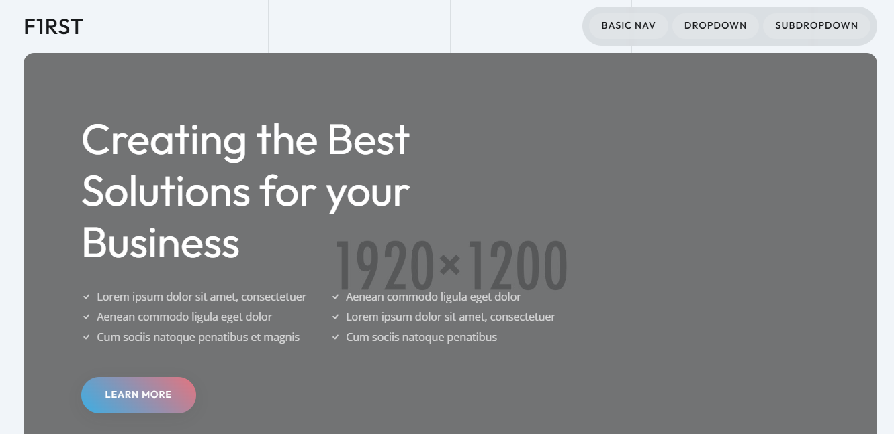

# F1rst Light Theme

**F1rst Light Theme** adalah tema modern, ringan, dan minimalis yang dirancang untuk memberikan pengalaman pengguna yang bersih dan estetis.

## Fitur Utama

- **Desain Ringan & Responsif** – Performa optimal dengan loading cepat.
- **Mode Terang yang Nyaman** – Palet warna seimbang untuk kenyamanan mata.
- **Mudah Dikustomisasi** – Gunakan CSS variabel untuk personalisasi.
- **Kompatibel dengan Berbagai Perangkat** – Desain responsif yang cocok untuk mobile & desktop.
- **Optimasi Performa** – Mengutamakan kecepatan dan efisiensi.

## Instalasi

Kloning repository ini dengan perintah berikut:

```sh
git clone https://github.com/f1rstid/f1rst-light-theme.git
```

## Cara Penggunaan

1. Masuk ke direktori tema:
   ```sh
   cd f1rst-light-theme
   ```
2. Tambahkan ke proyek Anda dan sesuaikan sesuai kebutuhan.
3. Nikmati tampilan modern dengan performa maksimal!

## Screenshot




## Lisensi

F1rst Light Theme dirilis di bawah lisensi **MIT** – bebas digunakan dan dimodifikasi!

## Kontak

Untuk pertanyaan atau masukan, hubungi kami di:
- [Website F1rstID](https://f1rst.id)
- Email: support@f1rst.id
- GitHub: [@f1rstid](https://github.com/f1rstInd)

---

**Dibuat dengan ❤️ oleh F1rstID**
